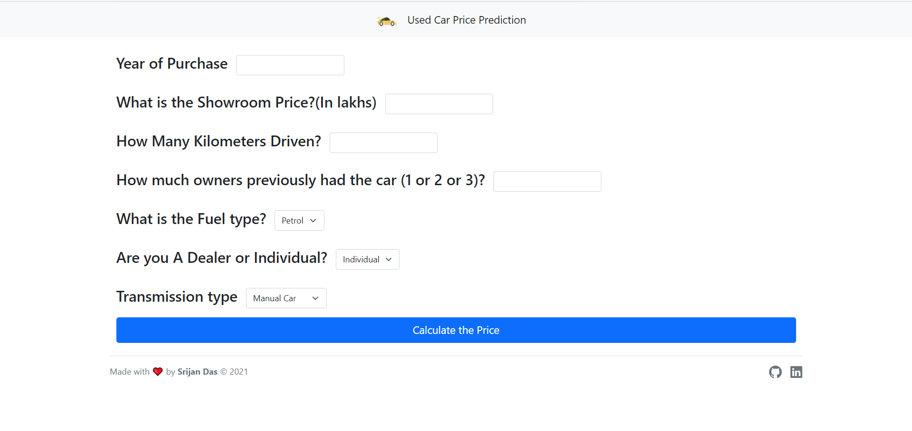
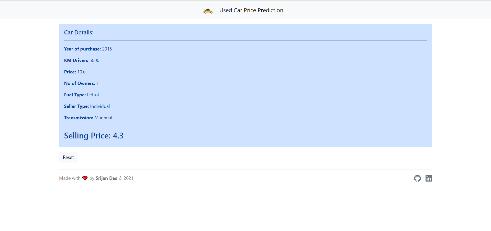
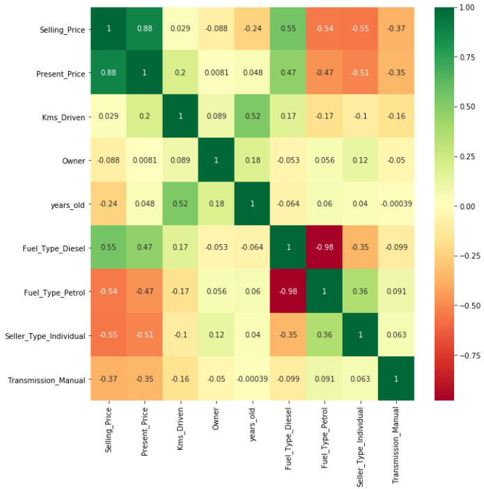

# [Used Car Price Prediction](https://used-car-price-predic.herokuapp.com/)


This webapp helps you to predict price of a used car with machine learning. You need to provide some neccessary information about the car like year of purchase, kms driven, number of owners etc. and it will predict the posible selling price.

## Demo

Webapp - https://used-car-price-predic.herokuapp.com/





## Tech Stack

**Client:** HTML, CSS, Bootstrap

**Server:** Python, Flask

## Run Locally

Clone the project

```bash
  https://github.com/SrijanDas/used-car-price-prediction.git
```

Go to the project directory

```bash
  cd used-car-price-prediction
```

Install dependencies

```bash
  pip install -r requirements.txt
```

Start the server

```bash
  python app.py
```

Go to your browser and type `http://127.0.0.1:5000/` in the address bar. Hurray! That's it.

## Roadmap

- Data Collection
- Data Cleaning and Preprocessing
- Model Building, Training and Testing
- Webapp Building
- Deployment

### Data Collection

Collected the vehicle dataset from kaggle.  
[vehicle-dataset-from-cardekho](https://www.kaggle.com/nehalbirla/vehicle-dataset-from-cardekho)

### Data Cleaning and Preprocessing

Analyzed the dataset using **pandas**, **seaborn** and **matplotlib**. After analyzing the correlation deleted the unnecessary columns.



Then converted categorical variables into dummy/indicator variables. For more info check this [Jupyter NoteBook](https://github.com/SrijanDas/used-car-price-prediction/blob/main/model/used_car_price_prediction.ipynb)

### Model Building, Training and Testing

Implemented different algorithms like Linear Regression, Ridge Regression and Random Forest to predict the car price and achieved mse of 0.98 with Random Forest. Finally selected the **Random Forest Regression** model for deployment. For more info check this [Jupyter NoteBook](https://github.com/SrijanDas/used-car-price-prediction/blob/main/model/used_car_price_prediction.ipynb)

### Webapp Building

The webapp was built with Flask, HTML, CSS, Javascript and Bootstrap.

### Deployment

The webapp was deployed on **_heroku_**

## Thank you 😃

[](https://srijan-das.web.app/)
[](https://www.linkedin.com/in/srijan-das-3591791b3)
[](https://twitter.com/Srijan_1805)
